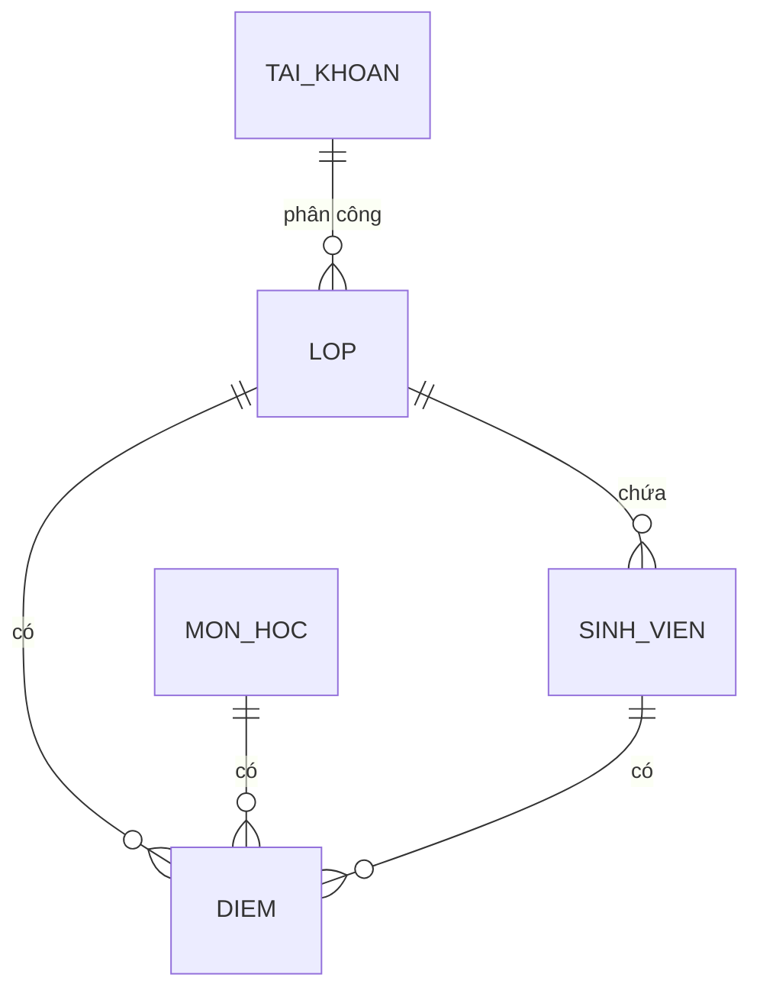

# WHITEBOOK – Phát Triển Website Quản Lý Nhập Liệu Điểm Và Xuất Báo Cáo Cho Giáo Viên

> Phiên bản: 2.0 | Cập nhật: 2026-09-25 | Trạng thái: Baseline Sprint 1

---

## 1. Thông Tin Đề Tài

**Tên đề tài:** Phát triển dự án website quản lý nhập liệu điểm và xuất báo cáo cho giáo viên  
**Mã đề tài:** QLD-2026-001  
**Sinh viên thực hiện:** Nguyễn Đức Cảnh (PO / Scrum Master / Developer)  
**Giảng viên hướng dẫn:** [Tên giảng viên]  
**Học kỳ / Năm học:** HK1 – 2026-2027  
**Repository:** `git@github.com:dotlinux26/quanlydiem.git`  
**Công nghệ chính:** React 19, Vite 8, Node.js 24, SQLite (better-sqlite3), React Router 7, SheetJS, Playwright  

---

## 2. Mục Tiêu Và Phạm Vi Dự Án

### 2.1. Mục Tiêu (SMART)

| Mục tiêu | Mô tả chi tiết | Tiêu chí đo lường |
|----------|----------------|-------------------|
| MT1 | Xây dựng luồng nhập/sửa điểm theo lớp và môn học, kiểm tra thực thời gian | 100% test case US-007 pass |
| MT2 | Phân quyền rõ ràng: Giáo viên chỉ thấy lớp được phân công, Người quản lý thấy toàn bộ | Không lỗ hổng truy cập dữ liệu |
| MT3 | Xuất báo cáo Excel/CSV chuẩn, đúng cột, đúng dữ liệu | File mở được, so khớp 100% |
| MT4 | Hoàn thành Sprint 1 (phiên bản V0) đúng hạn | 5/5 User Story Done, 0 bug mở |

### 2.2. Phạm Vi Dự Án

**Trong phạm vi (Sprint 1–3):**
- Người quản lý: Tạo/sửa/xóa lớp, sinh viên, môn học; phân công giáo viên; tạo tài khoản giáo viên
- Giáo viên: Xem danh sách lớp/sinh viên được phân công; nhập, sửa điểm; hệ thống tự kiểm tra và tính điểm tổng kết
- Tra cứu điểm theo nhiều tiêu chí; xuất bảng điểm Excel/CSV; xem báo cáo tổng hợp có biểu đồ
- Phân quyền dựa trên vai trò (Giáo viên / Người quản lý)

**Ngoài phạm vi:**
- Ứng dụng di động / PWA
- Học sinh tự tra điểm
- Tích hợp với phần mềm quản lý đào tạo của trường
- Kéo-thả (drag-drop), đồng bộ ngoại tuyến, đa ngôn ngữ

---

## 3. Người Dùng Và Sơ Đồ Use Case

### 3.1. Hai vai trò chính

**Giáo viên** – Người dùng chính, được phân công phụ trách một hoặc nhiều lớp.  
**Người quản lý** – Người quản trị hệ thống, có quyền truy cập toàn bộ dữ liệu và chức năng quản trị.

### 3.2. Sơ đồ Use Case (Mermaid)

```mermaid
useCaseDiagram
  actor "Giáo viên" as GV
  actor "Người quản lý" as QTV
  package "Hệ thống Quản Lý Điểm" {
    usecase "UC01: Xem lớp & sinh viên phân công" as UC1
    usecase "UC02: Nhập điểm" as UC2
    usecase "UC03: Sửa điểm" as UC3
    usecase "UC04: Kiểm tra & tính điểm tự động" as UC4
    usecase "UC05: Tra cứu điểm" as UC5
    usecase "UC06: Xuất Excel/CSV" as UC6
    usecase "UC07: Báo cáo tổng hợp" as UC7
    usecase "UC08: Quản trị lớp/sinh viên/môn" as UC8
    usecase "UC09: Quản trị tài khoản & phân quyền" as UC9
  }
  GV --> UC1, UC2, UC3, UC4, UC5, UC6, UC7
  QTV --> UC8, UC9
```

---

## 4. Danh Sách User Story Và Tiêu Chí Chấp Nhận (11 US)

### Theme 1: Quản Lý Dữ Liệu Học Tập
#### Epic 1: Quản Lý Lớp Học
**US-001** – Là **Giáo viên**, tôi muốn **xem danh sách lớp và sinh viên được phân công** để biết mình phụ trách lớp nào.  
- AC1: Đăng nhập bằng tài khoản giáo viên → thấy đúng 3 lớp được phân công  
- AC2: Chọn một lớp → hiển thị đúng 5 sinh viên thuộc lớp đó  
- AC3: Người quản lý đăng nhập → thấy toàn bộ 3 lớp  

**US-002** – Là **Người quản lý**, tôi muốn **tạo, sửa, xóa lớp học và phân công giáo viên** để duy trì dữ liệu lớp học.  
- AC1: Nhấn "Thêm lớp", điền tên lớp, năm học, chọn giáo viên → lớp mới xuất hiện ngay  
- AC2: Sửa tên lớp hoặc năm học → cập nhật thành công  
- AC3: Xóa lớp → hiện hộp xác nhận, đồng ý thì xóa (cascade xóa điểm liên quan)  

#### Epic 2: Quản Lý Sinh Viên
**US-003** – Là **Người quản lý**, tôi muốn **tạo, sửa, xóa sinh viên, nhập danh sách từ Excel, chuyển lớp** để quản lý danh sách học sinh.  
- AC1: Thêm từng sinh viên (mã, họ tên, chọn lớp) → lưu thành công  
- AC2: Tải file Excel mẫu, nhập danh sách → import 5 sinh viên/lớp một lần  
- AC3: Chuyển sinh viên sang lớp khác → cập nhật `lop_id` ngay  
- AC4: Xóa sinh viên → xác nhận, xóa luôn điểm liên quan  

#### Epic 3: Quản Lý Môn Học
**US-004** – Là **Người quản lý**, tôi muốn **tạo, sửa, xóa môn học (mã, tên, số tín chỉ)** để cập nhật chương trình đào tạo.  
- AC1: Thêm môn mới (mã duy nhất, tên, tín chỉ) → lưu thành công  
- AC2: Sửa thông tin môn → cập nhật ngay  
- AC3: Xóa môn → xác nhận, xóa cả điểm của môn đó  

---

### Theme 2: Quản Lý Điểm
#### Epic 4: Nhập & Kiểm Tra Điểm
**US-005** – Là **Giáo viên**, tôi muốn **nhập điểm cho sinh viên theo lớp và môn học** để lưu kết quả học tập.  
- AC1: Chọn lớp, chọn môn → hiện bảng 5 sinh viên với 3 cột nhập (Thường kỳ, Giữa kỳ, Cuối kỳ)  
- AC2: Nhập điểm dạng Việt Nam (ví dụ 7,5) → hệ thống hiểu là 7.5  
- AC3: Nhấn "Lưu" → upsert điểm, tính tự động Tổng kết, hiển thị trạng thái "Đã lưu"  

**US-006** – Là **Giáo viên**, tôi muốn **sửa điểm đã nhập** để cập nhật kết quả chính xác.  
- AC1: Điểm đã lưu vẫn cho phép sửa trực tiếp trên ô nhập  
- AC4: Sau khi lưu sửa → Tổng kết tính lại, cập nhật `updated_at`  

**US-007** – Là **Giáo viên**, tôi muốn **hệ thống tự kiểm tra điểm hợp lệ (0–10, bước 0.5) và tính điểm tổng kết (0.3/0.3/0.4)** để hạn chế sai sót.  
- AC1: Nhập 15 hoặc -1 → báo lỗi "Điểm phải từ 0 đến 10"  
- AC2: Nhập chữ "abc" → báo lỗi "Điểm không hợp lệ"  
- AC3: Nhập 8 / 7,5 / 9 → Tổng kết = 8.3 (làm tròn 1 chữ số, hiển thị 8,3)  
- AC4: Sửa một cột → Tổng kết tính lại tự động  

---

### Theme 3: Tra Cứu & Báo Cáo
#### Epic 5: Tra Cứu & Xuất Báo Cáo
**US-008** – Là **Giáo viên**, tôi muốn **tra cứu điểm theo lớp, môn học, sinh viên có phân trang** để theo dõi kết quả.  
- AC1: Bộ lọc: chọn lớp, chọn môn, nhập tên/mã sinh viên → lọc đúng  
- AC2: Kết quả hiển thị bảng có phân trang (20 dòng/trang)  
- AC3: Hiển thị đủ: STT, Mã SV, Họ tên, TK, GK, CK, Tổng kết, Trạng thái  

**US-009** – Là **Giáo viên**, tôi muốn **xuất bảng điểm ra file Excel (.xlsx) và CSV** để dùng trong công tác giảng dạy.  
- AC1: Nhấn "Xuất Excel" → tải file `.xlsx` đúng định dạng  
- AC2: Nhấn "Xuất CSV" → tải file `.csv` mở được bằng Excel  
- AC3: File chứa 8 cột: STT, Mã SV, Họ tên, TK, GK, CK, Tổng kết, Trạng thái  

**US-010** – Là **Giáo viên**, tôi muốn **xem báo cáo tổng hợp (điểm cao/thấp/trung bình, tỷ lệ đạt, biểu đồ)** để đánh giá tình hình lớp.  
- AC1: Chọn lớp, môn → hiển thị: điểm cao nhất, thấp nhất, trung bình, % đạt (≥5)  
- AC2: Biểu đồ cột phân bố điểm, biểu đồ tròn tỷ lệ đạt/không đạt (Chart.js)  
- AC3: Xuất báo cáo PDF (tùy chọn)  

#### Epic 6: Quản Trị Hệ Thống
**US-011** – Là **Người quản lý**, tôi muốn **tạo, sửa, xóa tài khoản giáo viên, gán vai trò, reset mật khẩu** để kiểm soát quyền truy cập.  
- AC1: Tạo tài khoản mới (tên đăng nhập, mật khẩu, họ tên, chọn vai trò Giáo viên/Người quản lý)  
- AC2: Sửa thông tin, đổi vai trò → áp dụng ngay lần đăng nhập sau  
- AC3: Reset mật khẩu về mặc định, khóa/mở tài khoản  
- AC4: Xóa tài khoản → xác nhận, không xóa được tài khoản người quản lý cuối cùng  

---

## 5. Quy Tắc Nghiệp Vụ (Business Rules)

| Mã | Quy tắc | Mô tả |
|----|---------|-------|
| BR-01 | Thang điểm | Mỗi cột điểm ∈ [0, 10], bước 0.5. Hỗ trợ nhập dấu phẩy (7,5 → 7.5) |
| BR-02 | Công thức tổng kết | `Tổng kết = ROUND(0.3×Thường_kỳ + 0.3×Giữa_kỳ + 0.4×Cuối_kỳ, 1)` |
| BR-03 | Độc nhất điểm | Một cặp (Sinh viên, Môn học, Lớp) chỉ có **một** bản ghi điểm (UNIQUE) |
| BR-04 | Phân quyền dữ liệu | Giáo viên chỉ thấy/làm việc với lớp có `giao_vien_id = id_của_mình` |
| BR-05 | Người quản lý toàn quyền | Người quản lý xem/sửa/xóa toàn bộ dữ liệu, không bị lọc |
| BR-06 | Mật khẩu | Lưu hash bcrypt (cost 10) từ Sprint 3; demo dùng plaintext |
| BR-07 | Xóa dữ liệu cha | Xóa lớp/sinh viên/môn → cascade xóa điểm liên quan (hoặc soft-delete) |
| BR-08 | Mã định danh | Mã SV: `SV####` (4 chữ số), Mã môn: `XXX###` (3 chữ + 3 số) |

---

## 6. Từ Điển Dữ Liệu & Sơ Đồ ER (6 thực thể)



### Chi tiết thuộc tính

| Thực thể | Thuộc tính (PK/FK) | Kiểu | Ràng buộc / Mô tả |
|----------|-------------------|------|-------------------|
| **LOP** | id (PK), ten, nam_hoc, giao_vien_id (FK→TAI_KHOAN) | INT, TEXT, TEXT, INT | ten UNIQUE trong cùng năm_hoc |
| **SINH_VIEN** | id (PK), ma (UK), ho_ten, lop_id (FK→LOP) | INT, TEXT, TEXT, INT | ma format `SV####` |
| **MON_HOC** | id (PK), ma (UK), ten, so_tin_chi | INT, TEXT, TEXT, INT | ma format `XXX###` |
| **DIEM** | id (PK), sinh_vien_id (FK), mon_hoc_id (FK), lop_id (FK), thuong_ky, giua_ky, cuoi_ky, tong_ket, created_at, updated_at | INT, INT, INT, INT, REAL, REAL, REAL, REAL, TEXT, TEXT | UK(sinh_vien_id, mon_hoc_id, lop_id); tong_ket tính theo BR-02 |
| **TAI_KHOAN** | id (PK), username (UK), password_hash, role, name, giao_vien_id (FK NULL) | INT, TEXT, TEXT, TEXT, TEXT, INT | role ∈ {GIAO_VIEN, QUAN_TRI_VIEN} |

---

## 7. Yêu Cầu Phi Chức Năng (Non-Functional)

| ID | Yêu cầu | Mức độ | Cách kiểm tra |
|----|---------|--------|---------------|
| NFR-01 | Tải trang < 2 giây (môi trường local) | Bắt buộc | Lighthouse |
| NFR-02 | Hỗ trợ Chrome, Edge, Firefox bản mới nhất | Bắt buộc | Thử thủ công |
| NFR-03 | Responsive ≤ 768px (bảng cuộn ngang, form xếp dọc) | Nên có | DevTools device toolbar |
| NFR-04 | Mật khẩu hash bcrypt cost 10 (từ Sprint 3) | Bắt buộc | Code review |
| NFR-05 | File SQLite < 5 MB (dữ liệu seed) | Bắt buộc | `ls -lh` |
| NFR-06 | Không lỗi console khi chạy E2E | Bắt buộc | Playwright |
| NFR-07 | Lint 0 lỗi (Oxlint) | Bắt buộc | `npm run lint` |
| NFR-08 | Unit test ≥ 80% dòng code utils/services | Nên có | `node --test` |

---

## 8. Giao Diện & Luồng Điều Hành

### 8.1. Sitemap
```
/ (Trang chủ) → /login →
  Giáo viên: /lop → /lop/:id → /lop/:id/diem
  Người quản lý: /admin → /admin/classes|/students|/subjects|/teachers
```

### 8.2. Các màn hình chính

| Màn hình | Đường dẫn | Vai trò | Thành phần chính |
|----------|-----------|---------|------------------|
| Trang chủ | `/` | Tất cả | Tiêu đề, mô tả 1 dòng, nút "Bắt đầu ngay" |
| Đăng nhập | `/login` | Tất cả | Form, gợi ý tài khoản demo |
| Danh sách lớp | `/lop` | Giáo viên | Card/bảng 3 lớp, nút "Xem sinh viên" |
| Danh sách SV | `/lop/:id` | Giáo viên | Bảng 5 SV, nút "Nhập điểm" mỗi hàng + "Nhập điểm cả lớp" |
| Nhập điểm | `/lop/:id/diem` | Giáo viên | Chọn môn, bảng inline 3 ô nhập, xuất Excel/CSV |
| Bảng điều khiển QTV | `/admin` | Người quản lý | 4 thẻ thống kê link sang CRUD |
| Quản lý lớp | `/admin/classes` | Người quản lý | Bảng CRUD + Modal thêm/sửa |

---

## 9. Kiến Trúc Hệ Thống

```
┌─────────────────┐       HTTP/REST        ┌────────────────────┐
│   React + Vite  │ ◀───────────────────▶  │  Node.js + Express │
│   (Frontend)    │                        │  + better-sqlite3  │
└─────────────────┘                        └────────────────────┘
                                                  │
                                          File SQLite
                                    quanlydiem.db (thư mục data/)
```

### API Contract tóm tắt (Sprint 2–3 triển khai)

| Method | Endpoint | Mô tả | Quyền |
|--------|----------|-------|-------|
| GET | `/api/lop` | Danh sách lớp (lọc theo GV) | GV, QTV |
| POST | `/api/lop` | Tạo lớp mới | QTV |
| PUT | `/api/lop/:id` | Sửa lớp | QTV |
| DELETE | `/api/lop/:id` | Xóa lớp | QTV |
| GET | `/api/lop/:id/sinh-vien` | Sinh viên trong lớp | GV, QTV |
| GET | `/api/mon-hoc` | Danh sách môn học | GV, QTV |
| GET | `/api/diem?lop=&mon=&sv=` | Tra cứu điểm | GV, QTV |
| POST | `/api/diem` | Upsert điểm | GV |
| GET | `/api/export/bang-diem/:lop/:mon` | Xuất Excel/CSV | GV |
| GET | `/api/bao-cao/:lop` | Thống kê + dữ liệu biểu đồ | GV |
| POST | `/api/auth/tai-khoan` | CRUD tài khoản | QTV |

---

## 10. Ràng Buộc & Giả Định

| Loại | Nội dung |
|------|----------|
| Công nghệ | Node 24+, React 19, Vite 8, Express, better-sqlite3 |
| Triển khai | Frontend tĩnh (Netlify/Vercel) + API server (Railway/Render/VPS) |
| Trình duyệt | Chrome 118+, Edge 118+, Firefox 119+ |
| Dữ liệu mẫu | Seed 15 SV, 3 lớp, 3 môn, 2 tài khoản; có nút reset dữ liệu |
| Phạm vi | Không mobile, không SSO, không realtime, không đa tenant |

---

## 11. Thuật Ngữ (Glossary)

| Thuật ngữ | Định nghĩa |
|-----------|------------|
| Tổng kết | Điểm trung bình có trọng số: 0.3×Thường kỳ + 0.3×Giữa kỳ + 0.4×Cuối kỳ |
| Thường kỳ (TK) | Điểm quá trình hàng ngày / bài tập |
| Giữa kỳ (GK) | Điểm kiểm tra giữa học kỳ |
| Cuối kỳ (CK) | Điểm thi kết thúc học kỳ |
| Phân công | Gán `giao_vien_id` vào bảng `LOP` |
| Upsert | INSERT nếu chưa tồn tại, UPDATE nếu đã có (theo UNIQUE key) |
| Người quản lý | Người quản lý hệ thống, có toàn quyền truy cập và quản trị |
| Giáo viên | Người nhập, tra cứu, xuất điểm (thay vì "teacher") |

---

## 12. Ma Trận Truy Duyệt (Traceability Matrix)

| US | Tiêu chí AC | Unit Test | E2E Test | File code chính |
|----|-------------|-----------|----------|-----------------|
| US-001 | AC1–AC3 | `lopService.test.js` | GV thấy 3 lớp | `ClassListPage.jsx`, `lopService.js` |
| US-002 | AC1–AC3 | `lopService.test.js` (CRUD) | QTV tạo/sửa/xóa lớp | `AdminClassesPage.jsx`, `lopService.js` |
| US-003 | AC1–AC4 | `sinhVienService.test.js` | QTV import Excel | `AdminStudentsPage.jsx`, `sinhVienService.js` |
| US-004 | AC1–AC3 | `monHocService.test.js` | QTV CRUD môn | `AdminSubjectsPage.jsx`, `monHocService.js` |
| US-005 | AC1–AC3 | `score.test.js` | GV nhập 7,5 → lưu | `ScoreEntryPage.jsx`, `diemService.js` |
| US-006 | AC1–AC3 | `diemService.test.js` | GV sửa điểm | `ScoreEntryPage.jsx`, `diemService.js` |
| US-007 | AC1–AC4 | `score.test.js` (12 cases) | GV nhập 15, abc, 7,5 | `utils/score.js`, `ScoreEntryPage.jsx` |
| US-008 | AC1–AC3 | `diemService.test.js` (filter) | QTV/GV lọc dữ liệu | `ScoreLookupPage.jsx`, `diemService.js` |
| US-009 | AC1–AC3 | `export.test.js` | Xuất Excel/CSV | `ScoreEntryPage.jsx` (handleExport) |
| US-010 | AC1–AC3 | `baoCaoService.test.js` | Xem báo cáo, chart | `ReportPage.jsx`, `baoCaoService.js` |
| US-011 | AC1–AC4 | `authService.test.js` | QTV tạo GV, reset pwd | `AdminAccountsPage.jsx`, `authService.js` |

---

> **Lưu ý:** Tài liệu này là **baseline** cho Sprint 1–3. Mọi thay đổi phạm vi phải cập nhật WHITEBOOK + đồng bộ `docs/*` + tạo GitHub Issue.